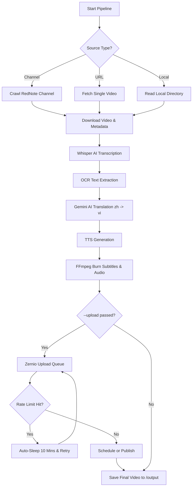

# 🎬 RedNote Clip Downloader & Translator

An automated, end-to-end pipeline designed to download videos from RedNote (rednote), transcribe the audio, translate Chinese to Vietnamese, generate a synchronized Vietnamese voiceover, and burn highly legible subtitles directly into the video—making it instantly ready for re-uploading to TikTok or Reels.

## ✨ Features

- **Automated Downloading**: Fetch single videos or crawl entire RedNote channels (powered natively by Playwright Chromium).
- **Metadata Extraction**: Captures original video captions, tags, and timestamps, saving them to JSON for use in TikTok uploads.
- **Smart State Tracking**: Automatically tracks processed videos by user ID, skipping duplicates. Ideal for daily scheduled runs!
- **Local Video Processing**: Easily process bulk `.mp4` files from a local directory.
- **Smart Transcription**: Uses local Whisper AI models to accurately transcribe Chinese audio.
- **OCR Text Extraction**: Scans videos for hardcoded Chinese text, translates it, and overlays a solid background box to cover the original text.
- **AI Translation with Glossary**: Uses Google Gemini AI (with a multi-model fallback system) to translate Chinese to Vietnamese. Supports a custom Glossary to enforce specific domain vocabulary!
- **Triple-Fallback TTS Engine**: Generates natural Vietnamese voiceovers in parallel using Microsoft Edge TTS, with automatic fallbacks to Python `edge-tts` and `google-tts-api` to prevent rate-limit crashes.
- **Auto-Trimming**: Automatically trims intros and RedNote watermarked outros without misaligning the audio/subtitles.
- **Subtitle Burn-in**: Highly stylized, aesthetic subtitle generation using FFmpeg ASS filters.

## 🌊 Execution Flow



## 🛠 Prerequisites

Before running this project, ensure you have the following installed on your system:
1. **Node.js** (v18 or higher)
2. **FFmpeg** (Must be installed and available in your system's PATH)
   - Mac: `brew install ffmpeg`
   - Windows: `winget install ffmpeg`
3. **Python 3.x** (Required for Whisper and `edge-tts` CLI fallbacks)

## 📦 Installation

1. **Clone the repository:**
   ```bash
   git clone https://github.com/yourusername/reup-rednote-clip.git
   cd reup-rednote-clip
   ```

2. **Install Node dependencies:**
   ```bash
   npm install
   ```

3. **Install Python dependencies (for fallbacks):**
   ```bash
   pip install edge-tts
   ```

4. **Environment Setup:**
   Copy the example environment file and fill in your keys.
   ```bash
   cp .env.example .env
   ```
   **Required Keys in `.env`:**
   - `GEMINI_API_KEY`: Your Google Gemini API Key for translation.
   - `TTS_PROVIDER`: Set to `google` to completely bypass Edge rate limits, or `auto` to attempt Edge first.

## 🚀 Usage

The pipeline is operated entirely via the CLI using a single, smart command. 

### Processing Videos
The `process` command automatically detects if you are passing a RedNote channel URL, a single RedNote video URL, or a local directory folder.

**1. Process an Entire Channel (Indefinite Crawl)**
```bash
node src/cli.js process "https://www.rednote.com/user/profile/..."
```

**2. Process a Single URL**
```bash
node src/cli.js process "https://www.rednote.com/explore/..."
```

**3. Process a Local Directory**
Process a folder of pre-downloaded `.mp4` files.
```bash
node src/cli.js process ./videos_test
```

### ⚙️ Helpful CLI Flags
You can append these flags to the `process` command:
- `--skip-ocr`: Skips optical character recognition (makes processing significantly faster if the video has no hardcoded on-screen text).
- `--skip-tts`: Skips Vietnamese voiceover generation (keeps original audio).
- `--limit <n>`: Limits the maximum number of *new* videos to process (Channels and Local only).
- `--force`: Ignores the pipeline state and forcefully re-processes all videos.
- `--upload`: Automatically uploads newly processed videos (AND any previously processed videos that haven't been uploaded yet) to TikTok via Zernio in chronological order.
- `--draft`: Upload video as a draft in Zernito instead of publishing immediately. You can go to Zernito Dashboard to manage draft videos.
- `--schedule <time>`: Schedule the upload for a specific time (ISO format, e.g., `2024-11-01T10:00:00Z`).
- `--schedule-interval <minutes>`: If you have many videos to publish, Zernito might reach a limit. This schedules subsequent videos apart by this interval. (e.g. `--schedule-interval 5`).
- `--delay <seconds>`: Delay between immediate uploads in seconds to avoid rate limits (default: 30).
- `--debug`: Enable verbose debug logging.

### 🔄 Automatic Rate Limit Handling
When using the upload features, the script intelligently handles Zernio API rate limits ("Please wait 10m before posting again"). If a rate limit is hit, the script will **automatically pause for 10 minutes** and retry the exact video without crashing or stopping your batch queue!

*Example:*
```bash
node src/cli.js process ./videos_test --skip-ocr --upload
```

## ⏱️ Scheduling Daily Runs

The `process` command tracks previously processed videos in `data/pipeline_state.json`. If you run the command again, it will **automatically skip already-processed videos**. This makes it perfect for a daily cron job! 

With the `--upload` flag, it creates a fully hands-free pipeline from RedNote straight to TikTok.

**Example Cron Job (runs every day at 8:00 AM):**
```bash
0 8 * * * cd /path/to/reup-rednote-clip && node src/cli.js process "https://www.rednote.com/user/profile/..." --skip-ocr --upload >> data/cron.log 2>&1
```

## 📚 Custom Dictionary (Glossary)

You can force the Gemini AI translator to translate specific Chinese terms into specific Vietnamese terms by adding them to your local glossary.

**Add a new term:**
```bash
node src/cli.js glossary-add "Capture One" "Capture One" "Phần mềm chỉnh sửa ảnh"
```

**List all terms:**
```bash
node src/cli.js glossary-list
```

## ✂️ Auto-Trimming
If the videos you are processing contain baked-in intros or RedNote watermark outros, you can automatically trim them. 
Open your `.env` file and adjust:
```env
CUT_INTRO_SECONDS=0.5
CUT_OUTRO_SECONDS=3.0
```
*Note: Trimming dynamically shifts all AI subtitles and voiceovers backwards to perfectly match the new timeline!*

## 📁 Folder Structure
- `data/downloads/`: Raw downloaded videos.
- `data/transcripts/`: Extracted Chinese SRTs from Whisper.
- `data/translated/`: Gemini translated Vietnamese SRTs.
- `data/output/`: Final rendered videos ready for TikTok.
- `data/temp/`: Ephemeral processing files.

## References
- Setup Zernito Turtorial Video: https://www.youtube.com/watch?v=nYFP985QuHk
- Zernito Document: https://docs.zernio.com
- Gemini API Document: https://ai.google.dev/gemini-api/docs?hl=vi
